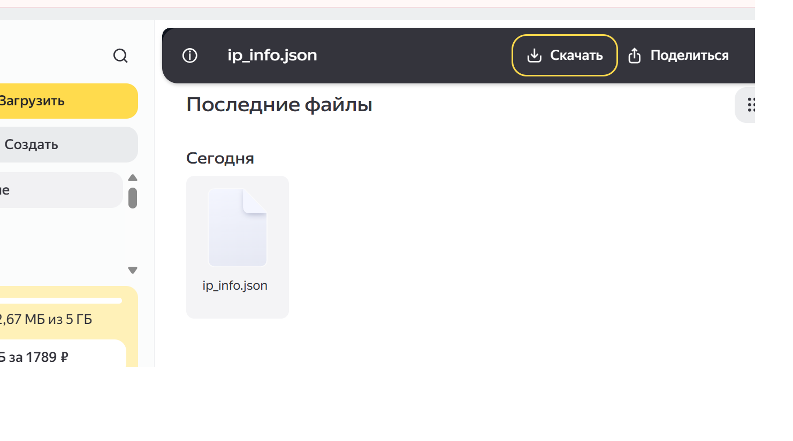
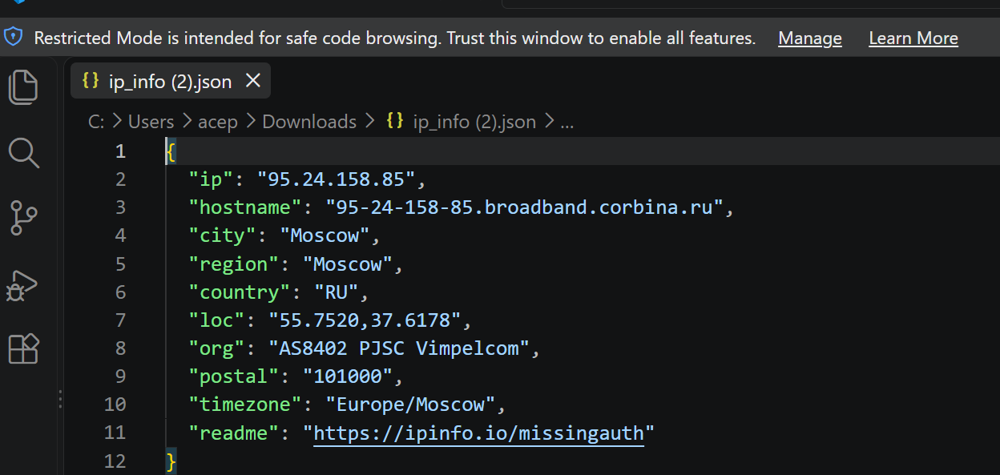

# IP Detector

Программа определяет текущий IP-адрес, получает географическую информацию через сервис IPinfo и загружает полученные данные на Яндекс.Диск в формате JSON.

## Настройка токена

Токен Яндекс.Диска не хранится в коде и не публикуется на GitHub. Программа считывает его из переменной окружения `YANDEX_TOKEN`.

Перед запуском программы в PowerShell необходимо выполнить:

```powershell
$env:YANDEX_TOKEN="ваш_токен"
python main.py
```

Вместо `ваш_токен` необходимо указать настоящий токен Яндекс.Диска.

Команду с настоящим токеном нельзя добавлять в README, сохранять на скриншотах или публиковать на GitHub.

## Результат работы

Программа создаёт на Яндекс.Диске папку `ip_detector` и загружает в неё файл `ip_info.json`.

### Запуск программы



### Папка с файлом на Яндекс.Диске


